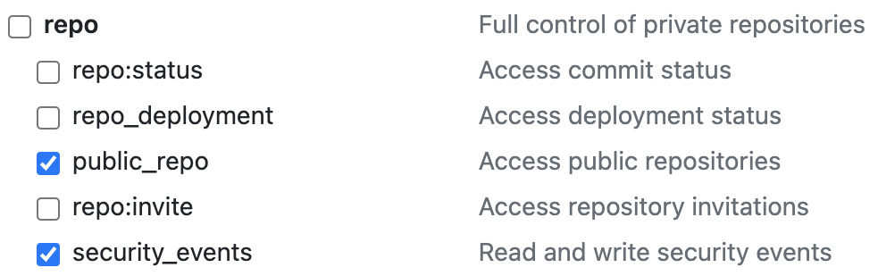

# GitHub Vulnerable Repo Reporter

[![ci-cd][ci-cd-badge]][ci-cd-url]

List the repositories owned by an organization that have a vulnerability alert.

This application requires a [GitHub Personal access token](https://github.com/settings/tokens/new). You can [create an access token] from the Developer settings page in your GitHub account settings. Set token to the GITHUB_TOKEN environment variable. You must be a member of the organization, and you must use an access token with the repo scope or security_events scope.


Use npx to run via command-line. The output lists repos with open security alerts. Repos without alerts are not listed.

```shell
GITHUB_TOKEN=ghp... npx -q @cumulusds/github-vulnerable-repos --organization MyOrg
```

```
Open-Source Vulnerability Report for MyOrg
Sun Sep 17 2023

parrot-backend
        CVE-2023-34104          HIGH fast-xml-parser vulnerable to Regex Injection via Doctype Entities (103d)
        CVE-2023-26920          HIGH fast-xml-parser vulnerable to Prototype Pollution through tag or attribute name (96d)
        GHSA-p9pc-299p-vxgp      LOW Prototype Pollution in yargs-parser (40m)
        GHSA-vh95-rmgr-6w4m      LOW Prototype Pollution in minimist (40m)

cluster-app
        GHSA-4g88-fppr-53pp     HIGH Prototype Pollution in set-value (70d)
        GHSA-ff7x-qrg7-qggm     HIGH Prototype Pollution in dot-prop (184d)
        GHSA-v8v8-6859-qxm4     HIGH Arbitrary shell command execution in logkitty (40m)
        GHSA-6chw-6frg-f759 MODERATE Regular Expression Denial of Service in Acorn (40m)
        GHSA-6c8f-qphg-qjgp      LOW Validation Bypass in kind-of (40m)
        GHSA-p9pc-299p-vxgp      LOW Prototype Pollution in yargs-parser (40m)
        GHSA-w7rc-rwvf-8q5r      LOW The `size` option isn't honored after following a redirect in node-fetch (40m)

app-api-gateway
        Vulnerability alerts are disabled

Summary for all 115 repositories
        8 skipped
        107 scanned: 3 vulnerable, 104 clean
```

The application reports on any repositories that have an open vulnerability alert or have alerting disabled. The report shows the age of each alert. Archived repos are not reported.

You can enable vulnerability alerts across your organization on the "Configure security and analysis features" page.

To output the report to a PDF file, use the `--report FILE` option. For example:

```
GITHUB_TOKEN=ghp... npx -q @cumulusds/github-vulnerable-repos --organization MyOrg --report MyVulnerabilityReport.pdf
```

[GitHub personal access token]: https://github.com/settings/tokens
[create an access token]: https://github.com/settings/tokens/new

# Development

- [Package Structure](doc/development.md#package-structure)
- [Development Environment](doc/development.md#development-environment)
- [Quality](doc/development.md#quality)
- [Release](doc/development.md#release)

## License

This package is [MIT licensed](LICENSE).

[ci-cd-url]: https://github.com/CumulusDS/github-vulnerable-repos/actions/workflows/ci-cd.yml
[ci-cd-badge]: https://github.com/CumulusDS/github-vulnerable-repos/actions/workflows/ci-cd.yml/badge.svg
